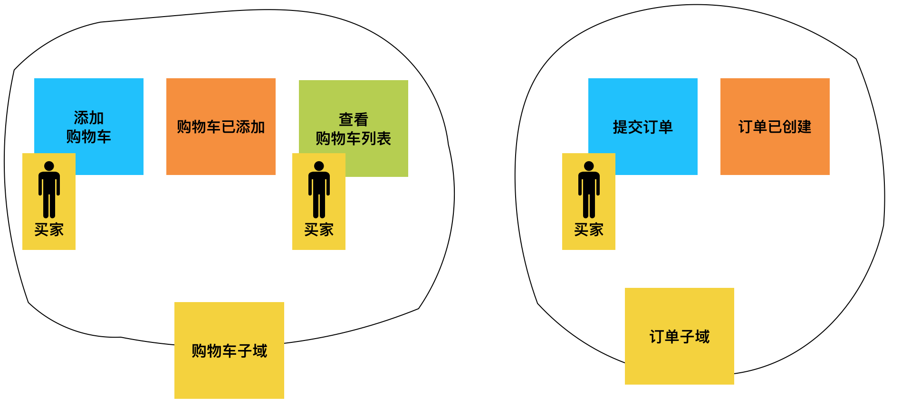
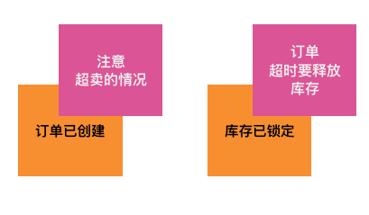
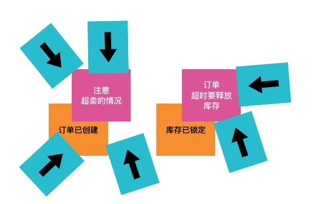
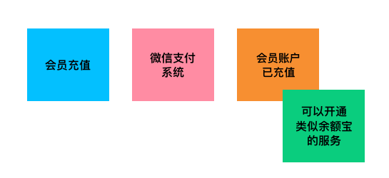

　　最近在公司内部组织了几场 Event Storming 的 workshop，这篇文章算是作为组织者交付的一份作业，希望更多同学可以了解并且组织这样的活动。

## 业务背景

　　假设我们是一家 B2C 的电商平台，姑且就叫做 “京西” 商城，创业一年多，创业初期一切都是野蛮生长，系统也是 “大泥球（单体应用）” 。公司发展很好，又融资 2000万美金，公司业务需要迅速扩张，而现有系统难以支撑公司业务的快速发展，需要进行微服务的拆分，同时开发团队的规模也要从过去的 20 人增加到 100 人。

　　新加入的同学需要快速了解现有业务，而产品经理也无法对所有业务进行完整描述，过去的开发人员只了解局部业务。业务需求无论是 “用户故事” 还是厚厚一沓需求文档，都难以让新老同学有一个**快速的**、**统一的**完整认知。

### [Event Storming](http://eventstorming.com/)

　　针对以上的种种困难，我们可以采用 [Event Storming](http://eventstorming.com/) 轻量级建模工具，来帮助我们较短的时间内快速理解业务的全景，达到统一的认知。

　　Event Storming 是完全按照 DDD（Domain Driven Design）的思想所派生出来的工具，所有当我们使用 Event Storming 去探索业务全景的同时，也产出了对业务系统的建模设计，这是与 User Journey 、用户故事地图（User Story Mapping）最大的区别。

#### 原则：通用语言

　　在过程中我们唯一需要遵守的重要原则是**通用语言** *（并不是其他原则不重要，而是我没记住，哈哈）*。通用语言在 DDD 中也是重要原则之一。有两层含义：

* 在我们描述业务系统时一定要使用业务场景中的方言，例如，在一件商品被卖空之后，我们电商业务会说**”售罄“**，在餐饮业务中会说**”估清“**。再比如：在很多系统中都会看到如下词汇”用户“、”客户“、”顾客“，这些词汇意思过于相近且难以区分，而在电商业务中更有表现力的词汇是**”买家“**、**”卖家“**。一方面强调所有人统一语言，另一方面减少大家的沟通成本。
* 刚刚说的是纯粹在语言上的通用，而另一层含义是在系统中。你有没有发程序员只是计算机的翻译，我们将业务逻辑翻译成计算机能够理解的语言，而产品经理却是将业务语言翻译成程序员能够理解的逻辑。中间有大量的语言转换，导致我们的系统与真实的业务相差甚远，这其实是不应该出现的一种结果。正确的结果是我们的系统结构与真实世界是一一对应。这一点在以后的 DDD 的文章中再详细阐述。

### 准备工作

　　寻找一个风和日丽的下午，一个大会议室，还要有一个巨大的白板、各种颜色的便签贴。

邀请上我们所有需要了解业务的同学：

* **领域专家（业务专家）**
* 产品经理
* 架构师
* DEV
* QA
* ...

　　我们可以邀请所有的相关人员，必不可少的是我们的**领域专家**，在没有领域专家的指导下我们很容易会按照自己的理解而走偏。

### 如何开始？

　　首先，由领域专家将业务背景进行一个大致的介绍，不需要很全面，让大家有一个基本的认识，然后按照如下步骤操作。

> 根据经验，如果参与的同学对业务完全陌生会导致两个极端：1. 所有人只是在观看领域专家在贴，无法参与其中。2. 人们在根据自己的理解胡乱贴便签，而领域专家需要不断纠正。虽然出现不同的想法是我们所希望看到的，但大量的纠正会导致时间上的浪费。

　　领域专家带领大家找到系统中认为最重要的**领域事件**，贴在我们的带有时间轴的白板上。

#### 贴领域事件——什么是领域事件（Domain Event）？

　　在系统中真实发生，需要被记录的事件*（大数据的同学，请不要说话！）*，且会对系统做出**反应**。需要被记录的事件也就意味着需要被追溯。举个例子：电商系统中产生了一笔交易，同时对买家的积分进行了增加。增加积分的事件则需要被记录，而不是单纯的对分数进行修改。当用户希望知道我的积分都去哪了，我们就可以将这些事件进行追溯。

> 大数据的同学会认为所有的事件都应该被记录，为什么不让说话？？？并不是对大数据同学的歧视，大数据并不属于业务系统，而是横切所有系统。

　　用橙色的便利贴表示领域事件，使用 名词 + 动词过去式，例如：订单已创建。通常以XX 已 XXX。

　　在带有时间轴的白板上贴上我们刚刚写好的事件，你认为在事件轴上的任意位置。以这张卡为参照，相继贴上在这张卡之前和之后的事件。

　　此时可以让每人轮流读出自己写好的卡片，并贴到白板上。如果参与的人数过多可以根据事件前后和参与人数进行分组。在贴卡的过程中，领域专家和组织者可以回答大家的业务问题，以及纠正卡片的错误。

　　最后，领域专家要带领大家将贴好的卡片进行梳理，剔除重复的卡片，删除在业务系统中不存在的事件等等。在梳理的过程中会发现很多意想不到的卡片，我们后面再讲。

#### 贴Policy——什么是Policy？

　　Policy 不太好翻译，翻译成“政策”有一点点奇怪， 是在较新的资料中才有，我们可以理解为规则。

　　在一些业务设计过程中会有很多的规则，这些规则通常不能被建模工具有效的方式表示，都变成了”潜规则“。例如：

*用户输错3次密码之后需要锁定账户。*

**输错3次密码** 就是我们的 Policy，锁定账户则是 Policy 又触发的领域事件。

用紫色的便利贴表示 Policy 即可。

#### 贴命令——什么是命令（Command）？

　　事件贴完了，接下来我们可开始贴**命令**。我们需要探索用户如何与我们的系统进行交互，命令代表着用户与系统的交互，而事件则是发生交互之后所产生的。

　　用蓝色的卡片表示命令。与 CQRS（Command Query Responsibility Segregation）的Command 含义相同。

*PS: 由于**命令** 与 **领域事件** 大部分是可以一一对应，为节省时间，可以在workshop 中适当省略。*

### 贴读模型——什么是读模型（Read Model）

在写**领域事件**的过程中出现了这样一张卡：

　　首先，我们需要先确认这张卡是否真的有这样的业务。买家是否有一个功能是可以看到自己所浏览过的商品列表？通常浏览列表不会被记录，记录的往往是商品详情，可能会有一个【最近浏览的商品】的功能与之对应，那么我们可以这样写：

　　有同学可能会说，我就是想标记出买家所看到的东西，有什么卡片可以帮助我们吗？这就是——**读模型**。

　　读模型与 Policy 都是较新的资料才出现的。是表示用户所看到的东西，之后用户会发出命令。

　　用浅绿色来表示读模型。与 CQRS 的 Query 含义相同。

#### 贴角色（role）

　　角色是系统中必不可少的，贴到这里我们可以轻易的识别出这一系列卡片由哪个角色触发。

　　用黄色表示角色。

　　贴到这里可以看出墙上的卡片已经可以连成一句话：【买家】在【查看购物车列表】后【提交订单】完成【订单已创建】，与我们写的用户故事越来越接近。

### 贴外部系统（External System）

　　在开发系统时多多少少都会与外部系统做集成，例如：支付系统、短信系统等等。我们通过浅粉色的卡片将外部系统表示出来。

### 划分子域（Sub Domain）

　　啥是业务子域？我们得先了解一下什么是**领域**（在文中下方有对**领域**的解释）。

**领域**：在文中提到了大量的”领域“ ，在没有了解过 DDD 的同学肯定晕菜了。我们先来看看书上是怎么说的:

> 领域（Domain）即是一个组织所做的事情以及其中所包含的一切。... 每个组织都有它自己的业务范围和做事方式。这个业务范围以及在其中所进行的活动便是领域。 
>
> ——《实现领域驱动设计》

 我们可以单纯的理解为 ”整个业务“ ，为什么不直接说 ”业务“ 呢？业务的含义过于广泛，而且一点都不神秘，不够酷！

为分解领域的复杂度，将领域划分为若干个子领。

> 就好比一个庞大的复杂设备是由千万个部件组成，而每一个部件又是由千万个零件组成。其目的是为了降低单个部件的复杂度，只需要将复杂构造和逻辑封装到部件内部，对外暴露出简单的接口即可。

　　子域理解起来相对容易，但想要**合理**的划分起来却非常困难，需要对这个子域中发生的所有事件划到一个 Scope 中，在探索的阶段我们可以暂时将事件的名词提炼出来，作为我们子域。

> PS：子域的划分正确并不容易，在项目初期并不建议过细粒度的划分，需要等业务边界足够稳定我们再将其划分。

　　到这一步我们已经完成了对业务全景图的探索，下面我们来玩一些更有趣的卡片。

### 贴警告信息（Hot spot）

　　现在我要给每个人手里发一把”大锤“，找出系统中你认为可能出现问题的”钉子“，用深粉标记出来。我们站在挑刺的角度可以发现系统中可能出现的很多问题，程序员尤其擅长这一点。当然，这里的”问题“不仅仅是开发时的问题，也可以是业务问题，或是流程问题，外部系统的问题。

### 投票评选瓶颈（Bottleneck）

　　既然选出了”热点问题“，接下来我们来给这些问题进行投票，找出我们需要优先解决的问题。每人一票（可根据情况适当增加），使用画有箭头的蓝色便利贴表示。

### 贴新的商机或者价值（Opportunity）

　　现在我要重新发给每一个一把新的”大锤“，找出我们系统中可能存在的商机或者价值。例如：我们是否可以提供 Plus 会员服务，是否在充值的基础上提供金融服务等等…使用绿色的便利贴表示。

### 其他有趣的元素

　　这些卡片并非一成不变，我们可以根据自己的需求给卡片加上图标，赋予便签特殊的含义。例如：定时任务、调度程序等等...

 ## 总结

　　以上就是我们今天所产出的所有内容，这些卡片可以帮助产品经理轻易的编写”用户故事“，同时还可以帮助开发人员业务建模，如果采用响应式编程（Reactive Programming）作为编程模型就可以将产出直接翻译成代码。

　　有参与过其他 Event Storming Workshop 的同学可能会发现与以往的不太一样。的确，Workshop 只是一种手段，Event Storming 做为建模工具也并非一成不变，卡片的颜色、顺序、多少可能不尽相同，只要为我们达到想要的目的就是好工具，不必要一定遵循某种规则。

　　Workshop 的过程不仅仅是出贴便签，还希望我们在贴便签过程更多的沟通。帮助参与者达到快速统一的理解。也希望大家能够在内部多组织这样的活动，谢谢！

